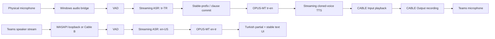

# MS Teams için düşük gecikmeli çift yönlü canlı çeviri

**Durum:** Araştırma ve karar öncesi teknik plan  
**Tarih:** 2026-09-02  
**Hedef platform:** Windows 11, NVIDIA GeForce RTX 5060 Ti 16 GB, 32 GB RAM

## 1. Kısa sonuç

İstenen sistem yerel ve büyük ölçüde açık modellerle yapılabilir. Ancak ses yolu ile yapay zekâ yolu birbirinden ayrılmalıdır:

- VB-CABLE sesi anlamaz veya çeviremez. Yalnızca bir uygulamanın ürettiği PCM sesi sanal bir oynatma aygıtından sanal mikrofon aygıtına taşır.
- Ses Windows audio stack ve sistem belleğinden geçtiği için “CPU'ya hiç uğramadan” bir yol mümkün değildir. Hedef, pahalı ASR/TTS hesabını GPU'da tutup CPU işini capture, resampling, hafif MT ve I/O ile sınırlamaktır.
- Türkçe mikrofon sesi uygulamaya alınır; ASR, çeviri ve ses klonlama/TTS aşamalarından sonra İngilizce PCM parçaları VB-CABLE'a yazılır. Teams bu aygıtı mikrofon olarak görür.
- Teams'ten gelen İngilizce ses WASAPI loopback veya ikinci bir sanal kablo ile yakalanır; ASR ve çeviriden sonra Türkçe metin arayüzde sürekli güncellenir.
- On saniyelik konuşmanın tamamı beklenmez. Kararlı kısa parçalar çevrilir ve sırayla gönderilir.
- Türkçe ile İngilizcenin sözcük dizimi farklı olduğu için güvenilir ses çevirisi tam anlamıyla kelime kelime olamaz. Birkaç yüz milisaniye ile kısa bir cümlecik kadar “çeviri bakışı” kaçınılmazdır.

Araştırma sonunda önerilen başlangıç yaklaşımı şudur:

1. Windows üzerinde yerel bir `audio bridge + desktop UI` çalıştırmak.
2. ASR için ilk iki deneyde `nvidia/nemotron-3.5-asr-streaming-0.6b` ve `Qwen/Qwen3-ASR-0.6B` modellerini karşılaştırmak; `Whisper large-v3-turbo`yu olgun geri dönüş seçeneği tutmak.
3. Her iki yönde çeviriyi CPU üzerinde `CTranslate2 + OPUS-MT tc-big` ile yapmak ve GPU belleğini ASR/TTS'ye bırakmak.
4. İngilizce ses üretiminde `Qwen3-TTS-0.6B-Base`, `XTTS-v2` ve `CosyVoice3`ü gerçek cihazda A/B test etmek. Açık lisans önceliğinde Qwen önde; Türkçe referanstan İngilizceye klonlama güvenilirliğinde XTTS güçlü fakat ticari olmayan bir model lisansına sahip.
5. En basit MVP'de tek VB-CABLE + WASAPI loopback kullanmak; ses izolasyonu gerekirse ikinci kabloya veya Teams sürecine özel WASAPI yakalamaya geçmek.

Bu, model kartlarına bakılarak verilmiş nihai model kararı değildir. RTX 5060 Ti üzerindeki ölçüm kapısından sonra seçim yapılmalıdır.

## 2. Kapsam ve başarı tanımı

### 2.1 Kullanıcı akışları

**Türkçe → İngilizce ses**

1. Fiziksel mikrofondan Türkçe ses alınır.
2. VAD konuşma bölgelerini belirler.
3. Streaming ASR geçici ve kararlı Türkçe metin üretir.
4. Kararlı metin İngilizceye çevrilir.
5. Seçilen ses profiliyle İngilizce PCM üretilir.
6. PCM, `CABLE Input` oynatma aygıtına yazılır.
7. Teams mikrofon olarak `CABLE Output` kayıt aygıtını kullanır.

**İngilizce ses → Türkçe yazı**

1. Teams'in hoparlöre gönderdiği İngilizce ses yakalanır.
2. Streaming ASR geçici ve kararlı İngilizce metin üretir.
3. Metin Türkçeye çevrilir.
4. Geçici çeviri arayüzde değiştirilebilir/gri; kararlı çeviri kalıcı satır olarak gösterilir.

### 2.2 İlk sürümde kapsam dışı

- Teams toplantısına sunucu taraflı bot olarak katılmak.
- Konuşmacı ayırma, toplantı özeti ve kayıt arşivi.
- Mobil istemci.
- Karşı tarafın sesini Türkçe ses olarak çalmak.
- Birden fazla eşzamanlı toplantı.
- Kullanıcı izni olmayan kişilerin sesini klonlamak.

### 2.3 Ölçülebilir hedefler

Model kartı gecikmeleri tam sistem gecikmesi değildir. İlk performans hedefleri deneysel kabul kriteridir:

| Ölçüm | P50 hedefi | P95 hedefi |
|---|---:|---:|
| İngilizce konuşma başlangıcı → ilk Türkçe geçici metin | ≤ 0,8 sn | ≤ 1,5 sn |
| İngilizce konuşma → kararlı Türkçe parça | ≤ 1,5 sn | ≤ 2,5 sn |
| Türkçe konuşma → ilk İngilizce ses | ≤ 1,5 sn | ≤ 2,5 sn |
| Uzun konuşmada biriken kuyruk | 0 sn'ye yakın | Sürekli büyümemeli |
| Ses kesilmesi/underrun | Yok | 30 dakikalık testte yok |

Bu değerler “konuşmanın anlamlı ve kararlı ilk parçası” içindir. Dilbilgisel olarak tamamlanması geç olan Türkçe cümlelerde daha uzun gecikme görülebilir.

## 3. Önerilen mimari



### 3.1 Süreç sınırları

Önerilen ilk uygulama iki süreçten oluşur:

**Windows audio bridge ve UI**

- Python 3.12.
- WASAPI mikrofon, loopback ve playback yönetimi.
- Ring buffer, resampling, sıra/backpressure kontrolü.
- Teams aygıt kurulum yardımcısı.
- Türkçe metin paneli, model durumu, gecikme ve ses profili seçimi.
- Model servisleriyle localhost WebSocket/HTTP iletişimi.

**Inference service**

- ASR oturumları, çeviri ve TTS sunucuları.
- Model başlatma, ısınma ve sağlık kontrolü.
- Seçilen motora göre native Windows veya WSL2/Linux çalışabilir.
- Qwen3-TTS'nin gerçekten parça parça PCM üretmesi için `vLLM-Omni` kullanılırsa Linux/WSL2 gerekir.

İlk deneyde Nemotron ASR, resmi `NeMo-Speech.cpp` ile native Windows CUDA üzerinde de çalıştırılabilir. Bu, ses sürücüsü ile model arasındaki ağ geçişini azaltır. Qwen3-ASR/TTS deneyleri için WSL2 servis yolu daha uyumludur. Son karar benchmark sonucuna göre tek veya karma runtime olabilir.

### 3.2 Neden uygulamanın tamamı Docker içinde olmamalı?

Windows ses aygıtlarına doğrudan ve düşük gecikmeli erişim konteyner içinde gereksiz zordur. Docker/WSL model servisi için yararlı, fakat WASAPI ve masaüstü arayüzü native Windows sürecinde kalmalıdır. Tek komutlu başlangıç daha sonra `start.ps1` ile iki tarafı birlikte ayağa kaldırabilir.

### 3.3 Python, Node.js ve MCP kararı

İlk sürüm için Python önerilir: model SDK'ları, CTranslate2, PyAudioWPatch ve PySide6 tek ekosistemde kalır. Node.js ancak Teams sürecine özel native WASAPI addon'u veya Electron yönünde belirgin bir avantaj çıkarsa yeniden değerlendirilir.

MCP canlı ses yolunun parçası olmamalıdır; ek protokol ve süreç latency'ye fayda sağlamaz. Geliştirme sırasında model kataloğu, benchmark sonuçları veya tanılama araçlarını ajanlara sunmak gerekirse ayrı bir yardımcı MCP düşünülebilir.

## 4. Teams ve sanal ses yönlendirmesi

VB-CABLE'ın resmi tanımında `CABLE Input` oynatma, `CABLE Output` kayıt ucudur; input'a yazılan ses output'tan okunur. Bu isimler ilk bakışta ters görünür. Kaynak: [VB-CABLE Reference Manual](https://vb-audio.com/Cable/VBCABLE_ReferenceManual.pdf).

### 4.1 Seçenek A — tek VB-CABLE, en hızlı MVP

- Uygulama fiziksel mikrofonu yakalar.
- Uygulama İngilizce TTS çıktısını `CABLE Input`a yazar.
- Teams mikrofonu `CABLE Output` olur.
- Teams hoparlörü fiziksel kulaklık olarak kalır.
- Uygulama fiziksel kulaklığın WASAPI loopback akışını yakalar.

Avantajları: tek sanal kablo, en az kurulum, kullanıcı Teams sesini doğrudan duyar.  
Dezavantajı: loopback aynı hoparlöre giden bildirim, müzik ve diğer uygulama seslerini de yakalar.

WASAPI loopback bir render endpoint'inde çalınan sesi yakalamak için Windows'un resmi mekanizmasıdır: [Microsoft WASAPI loopback](https://learn.microsoft.com/en-us/windows/win32/coreaudio/loopback-recording). Python 3.12 için [PyAudioWPatch](https://github.com/s0d3s/PyAudioWPatch) bunu kullanılabilir aygıt olarak sunar.

### 4.2 Seçenek B — iki sanal kablo, daha güçlü izolasyon

- Outgoing: uygulama → `CABLE-A Input` → Teams mic `CABLE-A Output`.
- Incoming: Teams speaker → `CABLE-B Input` → uygulama `CABLE-B Output`.
- Uygulama incoming ham sesi ayrıca fiziksel kulaklığa mirror eder.

Avantajı: yalnız Teams sesi çevrilir.  
Dezavantajı: ikinci kablo/VoiceMeeter kurulumu, bir ek buffer ve mirror işlemi vardır.

### 4.3 Seçenek C — Teams sürecine özel loopback

Microsoft'un `ApplicationLoopback` örneği Windows 10 build 20348 ve sonrasında bir süreç ağacının render sesini yakalayabilir: [Windows ApplicationLoopback sample](https://github.com/microsoft/Windows-classic-samples/tree/main/Samples/ApplicationLoopback). Böylece ikinci kablo olmadan Teams izolasyonu elde edilebilir.

Bu yol native C++ yardımcı servis veya dikkatle değerlendirilmiş bir Node native addon gerektirir. Küçük bir topluluk projesi olan [loopback-capture](https://github.com/WerdoxDev/loopback-capture) aynı API'yi sarmalar, fakat ilk sürümün güvenilirlik temeli yapılmamalıdır.

### 4.4 Teams medya botu neden MVP değil?

Teams application-hosted media bot'ları gerçek zamanlı medya akışına erişebilir; fakat Microsoft'un üretim şartları C#/.NET, `Microsoft.Graph.Communications.Calls.Media`, Windows Server/Azure ve erişilebilir bir ağ adresi gerektirir. Yerel kişisel kullanım için gereksiz karmaşıktır. Kaynak: [Microsoft Teams application-hosted media bot requirements](https://learn.microsoft.com/en-us/microsoftteams/platform/bots/calls-and-meetings/requirements-considerations-application-hosted-media-bots).

### 4.5 Teams ayarları

Teams mikrofon ve hoparlörü ayrı seçmeye izin verir: [Microsoft Teams audio settings](https://support.microsoft.com/en-US/teams/meetings/manage-audio-settings-in-microsoft-teams-meetings).

İlk test profili:

- Microphone: `CABLE Output`.
- Speaker: fiziksel kulaklık; Seçenek B'de `CABLE-B Input`.
- Synthetic TTS yolu için Teams noise suppression ve automatic mic sensitivity kapalı/fixed olarak A/B test edilmeli.
- Echo/feedback riskini azaltmak için hoparlör yerine kulaklık kullanılmalı.
- Tüm Windows/Teams aygıtları aynı temel formatta, tercihen 48 kHz olarak yapılandırılmalı; model giriş/çıkışında uygulama kontrollü resampling yapılmalı.

## 5. Streaming davranışı

### 5.1 Ses paketleme

- Windows ses callback'i: 10 veya 20 ms frame.
- ASR iç formatı: 16 kHz, mono, signed PCM16.
- TTS modeli: Qwen/CosyVoice için 24 kHz PCM16; render aygıtına 48 kHz resample.
- Süreçler arası taşıma: JSON/base64 yerine WebSocket binary PCM.
- Callback içinde model çağrısı veya disk I/O yapılmaz; lock-free ya da bounded ring buffer kullanılır.

### 5.2 Geçici ve kararlı metin

ASR her güncellemede önceki sözcükleri değiştirebilir. İki ayrı durum tutulmalıdır:

- `partial`: değiştirilebilir, UI'da anında gösterilir; eski hipotez geldiğinde atılabilir.
- `committed`: iki ardışık hipotezde aynı kalan veya endpoint ile kapanan metin; sırası değiştirilemez.

Incoming Türkçe metin kolayca revize edilebilir. Outgoing ses çalındıktan sonra geri alınamaz. Bu nedenle TTS yalnız committed çeviri alır.

### 5.3 Commit politikası

İlk politika aşağıdaki sinyalleri birlikte kullanır:

- ASR stable-prefix sonucu.
- Noktalama veya anlamsal kısa cümlecik sınırı.
- 250–450 ms sessizlik.
- Maksimum bekleme süresi.
- Minimum sözcük/karakter sayısı.
- Kuyruk doluluğu ve TTS real-time factor.

Türkçeden İngilizceye çeviride 3–8 kelimelik parçalar başlangıç noktasıdır; sabit bir sayı nihai ayar değildir. Çok küçük parça yanlış anlam ve mekanik konuşma, çok büyük parça yüksek gecikme üretir.

### 5.4 Backpressure

- Eski `partial` hipotezler düşürülebilir.
- `committed` MT/TTS parçaları sessizce düşürülemez veya yeniden sıralanamaz.
- TTS kuyruğu gerçek zamandan yavaşlarsa UI uyarı verir ve commit boyutu büyütülür.
- Toplantı başında bütün modeller ısıtılır; ilk gerçek cümle model yükleme bedeli ödemez.
- Her parçada monotonik `sequence_id` ve zaman damgaları taşınır.

## 6. ASR araştırması

### 6.1 Kısa liste

| Aday | Türkçe/İngilizce | Gerçek streaming | Lisans | Rol |
|---|---|---|---|---|
| [`nvidia/nemotron-3.5-asr-streaming-0.6b`](https://huggingface.co/nvidia/nemotron-3.5-asr-streaming-0.6b) | `tr-TR` transcription-ready, `en-US/en-GB` | Evet, cache-aware streaming | OpenMDW-1.1 | POC-1, gecikme adayı |
| [`Qwen/Qwen3-ASR-0.6B`](https://huggingface.co/Qwen/Qwen3-ASR-0.6B) | Türkçe ve İngilizce dahil 30 dil | Evet; resmi yerel streaming yolu vLLM | Apache-2.0 | POC-2, açık lisans adayı |
| [`openai/whisper-large-v3-turbo`](https://huggingface.co/openai/whisper-large-v3-turbo) | 99 dil | Native değil; LocalAgreement/window gerekir | MIT | Olgun geri dönüş |

**Nemotron 3.5 neden güçlü aday?**

- 0.6B model ve hazır Q8 GGUF yaklaşık 742 MB.
- Türkçe resmi “transcription-ready” dil kümesinde.
- Streaming için tasarlanmış; chunk/context/endpoint ayarları bulunuyor.
- Resmi [NeMo-Speech.cpp](https://github.com/NVIDIA/NeMo-Speech.cpp) Windows, CUDA 12/13, realtime WebSocket ve paylaşılan recognizer ile concurrency destekliyor.
- Risk: model/runtime çok yeni. Lisans Apache/MIT değil ve gerçek 5060 Ti kararlılığı ölçülmedi.

**Qwen3-ASR neden ikinci güçlü aday?**

- Apache-2.0, çok dilli ve aynı modelde offline/streaming kullanım.
- Türkçe açıkça destekleniyor.
- Risk: resmi yerel streaming vLLM yoluna bağlı; vLLM Windows'u native desteklemediğinden WSL2/Linux gerekir. Streaming modda timestamp kısıtları vardır.

**Whisper neden geri dönüş?**

- Çok olgun ekosistem, Türkçe kalitesi bilinen ve geniş donanım desteği olan model ailesi.
- `large-v3-turbo`, large-v3 decoder'ını hız için 32'den 4 katmana indirir.
- [faster-whisper](https://github.com/SYSTRAN/faster-whisper), [WhisperLive](https://github.com/collabora/WhisperLive) ve [whisper.cpp](https://github.com/ggml-org/whisper.cpp) uygulanabilir runtime'lardır.
- Whisper native streaming değildir. `whisper_streaming` çalışması LocalAgreement ile yaklaşık 3,3 saniye raporlamıştır ve proje artık [SimulStreaming](https://github.com/ufal/SimulStreaming) kullanımını önerir. Düşük gecikme hedefimiz için ölçmeden varsayılan seçilmemelidir.

### 6.2 Kullanım şekli

Tek ASR model örneği iki bağımsız state/session taşımalıdır:

- Session A: `tr-TR`, fiziksel mikrofon.
- Session B: `en-US`, Teams incoming.

Bu yaklaşım aynı ağırlıkları iki kez VRAM'e yüklememeli. Her oturumun VAD, context, partial ve endpoint state'i ayrıdır.

## 7. Makine çevirisi araştırması

### 7.1 Önerilen başlangıç

| Yön | Model | Boyut/lisans | Kullanım |
|---|---|---|---|
| Türkçe → İngilizce | [`Helsinki-NLP/opus-mt-tc-big-tr-en`](https://huggingface.co/Helsinki-NLP/opus-mt-tc-big-tr-en) | Yaklaşık 0.2B, CC-BY-4.0 | CTranslate2 CPU INT8, greedy/beam 1 |
| İngilizce → Türkçe | [`Helsinki-NLP/opus-mt-tc-big-en-tr`](https://huggingface.co/Helsinki-NLP/opus-mt-tc-big-en-tr) | Yaklaşık 0.2B, CC-BY-4.0 | CTranslate2 CPU INT8, greedy/beam 1 |

[CTranslate2](https://opennmt.net/CTranslate2/guides/transformers.html) MarianMT/OPUS modellerini destekler. Çeviriyi CPU'ya koymak 16 GB GPU belleğini iki ASR stream'i ve TTS için korur. İlk benchmark'ta `int8`, `int8_float16` ve beam 1/2 karşılaştırılır.

### 7.2 Alternatifler

- [`facebook/nllb-200-distilled-600M`](https://huggingface.co/facebook/nllb-200-distilled-600M): kalite karşılaştırması için kullanılabilir, fakat daha ağır ve CC-BY-NC-4.0 nedeniyle ticari kullanıma uygun değildir.
- [Argos Translate](https://github.com/argosopentech/argos-translate): CTranslate2 tabanlı kolay offline prototip; paket/model kontrolü ve streaming commit davranışı bizim doğrudan OPUS entegrasyonumuz kadar açık değildir.
- 4B sınıfı LLM/TranslateGemma/Riva Translate: 16 GB kartta ASR ve TTS ile aynı anda gereksiz VRAM ve decode gecikmesi oluşturur. MVP varsayılanı olmamalıdır.

### 7.3 Önemli dilbilimsel sınır

Türkçe çoğu yapıda yüklemi cümlenin sonuna taşır; İngilizce daha erken özne-fiil düzeni ister. Kaynak cümlenin başındaki her kelimeyi hemen İngilizce seslendirmek sonradan düzeltilemeyen hatalar üretir. Bu yüzden sistem “simultaneous interpretation” mantığında kısa ama kararlı anlam parçaları yayınlamalıdır. Bu, teknik optimizasyonla tamamen yok edilemeyen gecikme tabanıdır.

## 8. TTS ve ses klonlama araştırması

### 8.1 Kısa liste

| Aday | Streaming | Türkçe referanstan İngilizce klon | Lisans | Değerlendirme |
|---|---|---|---|---|
| [`Qwen3-TTS-12Hz-0.6B-Base`](https://huggingface.co/Qwen/Qwen3-TTS-12Hz-0.6B-Base) | vLLM-Omni ile gerçek PCM chunk | `x_vector_only` veya ICL ile ölçülmeli; Türkçe resmi çıktı dili değil | Apache-2.0 | Açık lisans + düşük gecikme birincil adayı |
| [`coqui/XTTS-v2`](https://huggingface.co/coqui/XTTS-v2) | Resmi API streaming, model iddiası <200 ms | Türkçe ve İngilizce resmi diller; cross-language cloning | Coqui Public Model License | İşlevsel kalite referansı; ticari olmayan lisans |
| [`FunAudioLLM/Fun-CosyVoice3-0.5B-2512`](https://huggingface.co/FunAudioLLM/Fun-CosyVoice3-0.5B-2512) | Bi-streaming, proje iddiası ~150 ms | Cross-lingual mod var; Türkçe kaynak deneysel doğrulanmalı | Apache-2.0 | Qwen alternatifi |
| [`ResembleAI/chatterbox`](https://github.com/resemble-ai/chatterbox) | Resmi yerel true-streaming yok | Türkçe ve İngilizce çok dilli klon | MIT | Kalite/offline referansı, latency baseline değil |

### 8.2 Qwen3-TTS ile ilgili kritik ayrıntı

Qwen'in model kartındaki 97 ms değeri modelin kendi en iyi koşul iddiasıdır; ASR + MT + commit + Windows audio gecikmesi değildir. Ayrıca yüksek seviyeli `qwen-tts` Python metodundaki `non_streaming_mode=false`, mevcut kod açıklamasına göre gerçek streaming üretmek yerine streaming metni simüle eder.

Gerçek parça parça PCM için [vLLM-Omni Speech API](https://docs.vllm.ai/projects/vllm-omni/en/latest/serving/speech_api/) kullanılmalıdır. API:

- Qwen3-TTS 0.6B Base voice cloning'i destekler.
- `ref_audio`, `ref_text` ve `x_vector_only_mode` alır.
- WebSocket üzerinden incremental text kabul eder.
- Cümle sınırında üretime başlar ve `stream_audio=true` ile birden çok PCM chunk döndürür.
- Yüklenen ses profilini/cache'i tekrar kullanabilir.

Bu nedenle bizim commit/flush politikamız, TTS'nin ne zaman başlayacağını doğrudan belirler.

### 8.3 Türkçe sesten İngilizce klon riski

Qwen3-TTS'nin resmi çıktı dilleri arasında İngilizce var, Türkçe yok. Hedef çıktı İngilizce olduğu için üretim tarafı uygundur; fakat yalnız Türkçe referans ses + Türkçe transcript ile ICL kalitesi garanti edilemez. Üç yöntem karşılaştırılmalıdır:

1. Türkçe referansla `x_vector_only_mode=true`.
2. Temiz Türkçe referans ve doğru transcript ile ICL; çalışma durumu deneysel.
3. Aynı kullanıcının kısa, okunmuş İngilizce referansı ile ICL.

Kullanıcının İngilizce telaffuzu kusursuz olmak zorunda değildir; amaç ses rengini çıkarmaktır. Yine de nihai varsayılan seçim dinleme testinden geçmelidir. Türkçe referansın mutlak şart olduğu durumda XTTS-v2 kalite/işlev referansı olur; ticari kullanım ihtimali varsa lisansı nedeniyle ürün seçimi olamaz.

### 8.4 Ses profili sözleşmesi

MVP için SQLite gerekmez. Her ses bir klasör ve manifest ile taşınabilir:

```text
voices/
  onur-default/
    reference.wav
    profile.json
```

Önerilen `profile.json` alanları:

```json
{
  "id": "onur-default",
  "display_name": "Onur - Default",
  "backend": "qwen3-tts-0.6b-base",
  "reference_audio": "reference.wav",
  "reference_text": "Reference recording transcript",
  "reference_language": "Turkish",
  "target_language": "English",
  "x_vector_only": false,
  "is_default": true,
  "consent_recorded_at": "2026-09-02T00:00:00+03:00"
}
```

- Referans 10–30 saniye temiz, tek konuşmacı, yankısız WAV olmalıdır; modelin minimum iddiası daha kısa olsa da çoklu örnek kalite testinde denenir.
- Conditioning/prompt uygulama açılışında önceden hesaplanıp cache'lenir.
- Birden fazla profil UI'dan seçilir; `is_default` yalnız bir profilde true olur.
- Yalnız kullanıcının kendi veya açık izinli sesi kabul edilir.

## 9. İncelenen mevcut projeler

| Proje | Bize katkısı | Doğrudan temel olmasının eksiği |
|---|---|---|
| [NBS282/LiveTranslate](https://github.com/NBS282/LiveTranslate) | Rust/Tauri, Parakeet + MarianMT + Piper/Pocket TTS, virtual cable; exact outgoing akışa yakın | Türkçe uygulama desteği ve incoming sistem sesi yok; ses klonlama hedefi zayıf |
| [kizuna-ai-lab/sokuji](https://github.com/kizuna-ai-lab/sokuji) | Electron/browser UI, iki yönlü mic/system-audio fikirleri, çok sağlayıcı | Güçlü iki yönlü mod bulut servisine dayanıyor; yerel yol kalite/latency için ölçülmeli |
| [JacobLinCool/open-realtime-translate](https://github.com/JacobLinCool/open-realtime-translate) | Qwen ASR + MT + Qwen TTS, OpenAI uyumlu yerel realtime backend | Windows/Teams audio bridge yok; varsayılan 4B MT 16 GB için ağır; CUDA performansı ayrıca doğrulanmalı |
| [VoxisLive/voxislive](https://github.com/VoxisLive/voxislive) | Teams'e yönelik çift yönlü UX ve audio routing referansı | Gemini Live/BYOK cloud temelli; local açık-model çekirdeği değil |
| [collabora/WhisperLive](https://github.com/collabora/WhisperLive) | WebSocket raw PCM, faster-whisper/TensorRT/OpenVINO, Python 3.12 | Yalnız ASR; Whisper native simultaneous model değil |
| [ufal/SimulStreaming](https://github.com/ufal/SimulStreaming) | Stable-prefix/AlignAtt simultaneous translation algoritmaları | EuroLLM 9B yolu 16 GB ve çift stream için ağır |
| [facebookresearch/seamless_communication](https://github.com/facebookresearch/seamless_communication) | SeamlessStreaming doğrudan S2TT/S2ST karşılaştırması | 2.5B, eski bağımlılıklar, CC-BY-NC model ağırlıkları, exact voice cloning yok |
| [NVIDIA/NeMo-Speech.cpp](https://github.com/NVIDIA/NeMo-Speech.cpp) | Çok yeni ama resmi, native Windows CUDA, streaming ASR/WebSocket, GGUF | TTS modeli zero-shot voice cloning amaçlı değil; 4B NMT varsayılanımızdan ağır |

### 9.1 Fork kararı

İlk aşamada bir projeyi doğrudan fork etmek yerine iki kısa spike yapılmalıdır:

- `open-realtime-translate` CUDA profili: Qwen zincirinin bu GPU'daki gerçek VRAM ve first-audio süresini ölçmek.
- `LiveTranslate` veya küçük özel bridge: Teams → VB-CABLE ses yönlendirmesini modellerden bağımsız doğrulamak.

Sonrasında:

- Backend protokolü ve stage ayrımı uygunsa `open-realtime-translate` bileşenleri yeniden kullanılabilir.
- Rust/Tauri kod tabanı benimsenirse `LiveTranslate` genişletilebilir; ancak incoming ve voice cloning nedeniyle değişiklik yüzeyi büyüktür.
- En düşük karmaşıklık, ihtiyacımız kadar küçük Python bridge + değiştirilebilir model adapter'ları yazmak olabilir.

Her projede kod kopyalamadan önce o commit'in lisansı ayrıca doğrulanmalıdır.

## 10. Önerilen paketler ve araçlar

Sürümler Phase 0 uyumluluk testi bitmeden sabitlenmemelidir. RTX 50/Blackwell için PyTorch/CUDA wheel seçimi özellikle ölçülmelidir.

### 10.1 Windows bridge/UI

| Paket/araç | Amaç |
|---|---|
| `PySide6` | Desktop UI, input/overlay ve tray |
| `PyAudioWPatch` | WASAPI mikrofon, output ve loopback |
| `numpy` | PCM tamponları |
| `soxr` | Kontrollü düşük gecikmeli resampling |
| `websockets` veya `httpx` | Inference servisleri |
| `pydantic` + `pydantic-settings` | Konfigürasyon ve voice manifest |
| `soundfile` | Referans/diagnostic WAV okuma-yazma |
| `psutil` | Süreç ve aygıt tanılama |
| `nvidia-ml-py` | VRAM/GPU telemetrisi |

### 10.2 Model katmanı

| Paket/araç | Amaç |
|---|---|
| `NeMo-Speech.cpp` | Nemotron streaming ASR, native server adayı |
| `qwen-asr[vllm]` + `vllm` | Qwen3-ASR streaming adayı |
| `vllm-omni` | Qwen3-TTS/CosyVoice gerçek PCM streaming |
| `ctranslate2` | OPUS-MT düşük gecikmeli CPU inference |
| `transformers` + `sentencepiece` | Model dönüştürme/tokenizer |
| `silero-vad` veya ONNX modeli | VAD/endpointing; 16 kHz'de 32 ms chunk destekler |
| `faster-whisper` | Whisper geri dönüş yolu |
| `fastapi` + `uvicorn` | Gerekirse ince orchestration/health API |
| `huggingface_hub` / `hf` | Model indirme, cache ve revision pinleme |

### 10.3 Geliştirme

- `uv`: Python ortamı ve lockfile.
- `pytest`, `pytest-asyncio`: pipeline ve WebSocket testleri.
- `ruff`, `mypy`: kalite kontrolleri.
- `ffmpeg`/`sox`: yalnız analiz ve fixture hazırlama; canlı callback zincirinde process spawn edilmez.
- `Docker`/Compose: yalnız Linux model servisleri gerekirse.

## 11. Donanım ve ortam ön kontrolü

2026-09-02 tarihinde yapılan salt-okunur kontrolde:

- GPU `NVIDIA GeForce RTX 5060 Ti`, 16.311 MiB VRAM olarak görüldü.
- NVIDIA sürücüsü desteklediği en yüksek CUDA sürümünü 13.3 olarak raporladı. Bu, kurulu CUDA Toolkit sürümüyle aynı kavram değildir; kullanıcıdaki 12.8 toolkit iddiası ayrıca `nvcc --version` ile doğrulanmalıdır.
- Kontrol anında yaklaşık 11,3 GB VRAM kullanımda ve GPU kullanımı %100'dü; ana tüketici bir `python_embeded/python.exe` süreciydi. Benchmark öncesi ComfyUI/Ollama ve diğer GPU iş yükleri kapatılmalıdır.
- `hf` komutu kaldırılmış bir Python 3.12 yoluna işaret ettiği için çalışmadı.
- `python`/`py` bu shell'de PATH üzerinde bulunamadı.
- Docker CLI kurulu, daemon çalışmıyordu.
- WSL durumu mevcut sandbox oturumunda erişim hatası verdi; WSL'in kurulu olmadığı sonucu çıkarılamaz.

Phase 0, model indirmeden önce bu araç zincirini düzeltmelidir. Driver'ın gösterdiği “CUDA 13.3” nedeniyle ayrı toolkit'i körlemesine değiştirmek doğru değildir.

## 12. Latency bütçesi ve telemetri

İlk teorik bütçe, garanti değil tuning başlangıcıdır:

| Aşama | Başlangıç bütçesi |
|---|---:|
| Capture + frame queue | 20–60 ms |
| İlk ASR partial | 100–500 ms |
| Stability/linguistic commit | 300–1.200+ ms |
| OPUS-MT | 20–100 ms |
| İlk TTS PCM | 100–500 ms |
| Resample + cable render | 20–80 ms |

Her ses parçasında şu zaman damgaları kaydedilmelidir:

- `audio_captured_at`
- `vad_started_at`
- `asr_first_partial_at`
- `asr_committed_at`
- `mt_completed_at`
- `tts_first_pcm_at`
- `cable_write_at`
- `ui_partial_at` / `ui_committed_at`

Ayrıca real-time factor, queue depth, dropped partial count, buffer underrun/overrun, GPU VRAM ve GPU utilization tutulur. Varsayılan olarak ham ses ve toplantı transcript'i diske yazılmaz; telemetry yalnız süre ve sayaç içerir.

## 13. Uygulama aşamaları

### Phase 0 — ortam ve benchmark kapısı

Amaç: mimariyi model kartıyla değil gerçek donanımla seçmek.

1. Python 3.12/`uv`, `hf`, CUDA Toolkit ve WSL2 durumunu düzelt/doğrula.
2. GPU boşken her modeli indirip revision + lisans manifesti oluştur.
3. Nemotron, Qwen3-ASR ve Whisper için aynı Türkçe/İngilizce corpus'ta:
   - first partial,
   - stable latency,
   - WER/CER,
   - RTF,
   - iki eşzamanlı stream,
   - VRAM ölç.
4. İki OPUS-MT modelini CPU INT8/beam ayarlarıyla ölç.
5. Qwen3-TTS, XTTS-v2 ve CosyVoice3 için:
   - time-to-first-PCM,
   - uzun üretimde RTF,
   - ses benzerliği,
   - Türkçe referans → İngilizce klon kalitesi,
   - VRAM ölç.
6. 30 dakika iki yönlü sentetik soak testi yap.

**Çıkış kararı:** ASR runtime, TTS runtime ve WSL/native sınırı seçilmiş olur.

### Phase 1 — modelden bağımsız audio bridge

1. Aygıt listeleme ve kalıcı stable device ID seçimi.
2. Fiziksel mic capture → test tone/recording → `CABLE Input` playback.
3. Teams speaker WASAPI loopback → diagnostic meter/WAV fixture.
4. 10/20 ms bounded ring buffer ve resampler.
5. Device disconnect/reconnect ve sample-rate mismatch testleri.
6. Teams test call ile tek kablo yolu doğrulama.

**Çıkış kriteri:** Modelsiz round-trip kararlı; Teams doğru aygıtı alıyor, feedback yok.

### Phase 2 — incoming İngilizce → Türkçe metin MVP

1. VAD + English streaming ASR session.
2. Partial/stable state machine.
3. OPUS-MT en-tr.
4. UI input/overlay; partial replacement ve stable append.
5. Teknik terim/glossary ve hotword mekanizması.

**Çıkış kriteri:** 30 dakika toplantı sesinde kuyruk büyümeden hedef latency.

### Phase 3 — outgoing Türkçe → İngilizce varsayılan ses

1. Turkish streaming ASR session.
2. Commit policy ve OPUS-MT tr-en.
3. İlk olarak hazır düşük gecikmeli İngilizce sesle uçtan uca doğrulama.
4. Qwen/XTTS/CosyVoice voice profile adapter.
5. PCM chunk queue → `CABLE Input`.
6. Uzun konuşma, kısa durak, self-correction ve cancel davranışı.

**Çıkış kriteri:** Kullanıcı 10 saniye konuşurken karşı taraf ilk kısa parçayı tüm konuşma bitmeden duyar; cümle sırası bozulmaz.

### Phase 4 — ses profilleri ve ürünleştirme

1. Referans ses kayıt sihirbazı ve kalite kontrolü.
2. Çoklu profil, default seçim ve prompt cache.
3. Tek komut `start.ps1`, health checks ve warm-up progress.
4. Gizlilik ayarları; transcript persistence varsayılan kapalı.
5. İsteğe bağlı SQLite yalnız ayarlar/geçmiş gerçekten gerekirse.

### Phase 5 — izolasyon ve optimizasyon

1. Tek kablo loopback'te dış ses kirliliği ölç.
2. Gerekirse Cable A/B veya Teams process-loopback helper.
3. CUDA Graph/quantization/batching ve model scheduler tuning.
4. Installer, crash recovery ve otomatik device failover.

## 14. Test corpus'u

En az aşağıdakiler bulunmalı:

- Kısa Türkçe komutlar ve selamlaşmalar.
- 10–30 saniyelik Türkçe teknik açıklamalar.
- Devrik ve yüklemi sonda uzun Türkçe cümleler.
- İsim, ürün, sayı, tarih, URL ve İngilizce teknik terim içeren Türkçe.
- Temiz ve toplantı kodeği bozulmuş İngilizce ses.
- Farklı İngilizce aksanları.
- Arka plan gürültüsü, sessizlik, üst üste konuşma ve Teams bildirim sesi.
- Kullanıcının 3, 10 ve 30 saniyelik temiz Türkçe voice reference örnekleri.

Kalite metrikleri:

- ASR: WER/CER ve özel terim doğruluğu.
- MT: chrF ve insan değerlendirmesi; yalnız BLEU yeterli değildir.
- TTS: speaker embedding similarity + kör A/B dinleme + anlaşılabilirlik.
- Uçtan uca: first partial, first committed translation, first PCM, P50/P95 ve kuyruk büyümesi.

## 15. Riskler ve azaltma yolları

| Risk | Etki | Azaltma |
|---|---|---|
| Türkçe cümle sonu bekleme | Outgoing ses gecikir | Stable-prefix + clause commit; glossary; maksimum bekleme |
| Qwen Türkçe referans klonu zayıf | Ses benzerliği düşer | x-vector/ICL A/B; kısa İngilizce ref; XTTS/CosyVoice benchmark |
| TTS gerçek zamandan yavaş | Kuyruk büyür | 0.6B model, warm-up, PCM streaming, bounded queue ve telemetry |
| 16 GB VRAM çatışması | OOM/stutter | MT CPU; tek paylaşılan ASR; 4B modelleri dışla; GPU süreçlerini kapat |
| RTX 50/CUDA wheel uyumsuzluğu | Kurulum çalışmaz | Phase 0 compatibility matrix; revision/version pin |
| Sistem loopback başka sesleri alır | Yanlış transcript | Kulaklık endpoint izolasyonu; Cable B veya per-process capture |
| Teams processing TTS'yi bozar | Karşı tarafa robotik/kesik ses | Noise suppression/auto gain A/B; sabit 48 kHz; level test |
| Model/repo lisansı | Ürün kullanımı kısıtlanır | Her artifact için SPDX/lisans manifesti; XTTS/NLLB/Seamless'i ticari yoldan çıkar |
| Ham ses/transcript gizliliği | Toplantı verisi riski | Localhost-only, persistence off, log redaction, açık kayıt göstergesi |

## 16. Nihai karar kapısı

Phase 0 sonunda kullanıcıya şu tablo gerçek ölçümlerle sunulmalıdır:

| Karar | Adaylar | Seçim ölçütü |
|---|---|---|
| ASR | Nemotron 3.5 / Qwen3-ASR / Whisper turbo | En düşük P95 stable latency; kabul edilebilir tr/en WER; 2 stream |
| MT | OPUS tc-big / küçük OPUS / NLLB benchmark | CPU latency + insan değerlendirmesi + lisans |
| TTS | Qwen3-TTS / XTTS-v2 / CosyVoice3 | İlk PCM + RTF + Türkçe ref'ten İngilizce speaker similarity + lisans |
| Audio capture | Tek cable loopback / iki cable / per-process | İzolasyon, kurulum ve buffer latency |
| Runtime | Native Windows / WSL2 / karma | Kurulum tekrarlanabilirliği, VRAM ve stabilite |
| Kod tabanı | Özel minimal bridge / repo fork | Değişiklik yüzeyi, lisans, bakım ve measured latency |

Ön araştırma tercihi, benchmark'a götürülecek ilk kombinasyon olarak şudur:

```text
Windows Python audio bridge + PySide6
  ASR POC-1: Nemotron 3.5 0.6B / NeMo-Speech.cpp
  ASR POC-2: Qwen3-ASR 0.6B / vLLM
  MT: OPUS-MT tc-big tr-en + en-tr / CTranslate2 CPU INT8
  TTS POC-1: Qwen3-TTS 0.6B Base / vLLM-Omni PCM WebSocket
  TTS POC-2: XTTS-v2 or CosyVoice3
  Audio MVP: one VB-CABLE outbound + WASAPI loopback inbound
```

Henüz kalıcı mimari veya model kararı alınmış sayılmaz.

## 17. Başlıca kaynaklar

- [VB-CABLE Reference Manual](https://vb-audio.com/Cable/VBCABLE_ReferenceManual.pdf)
- [Microsoft WASAPI loopback recording](https://learn.microsoft.com/en-us/windows/win32/coreaudio/loopback-recording)
- [Microsoft ApplicationLoopback sample](https://github.com/microsoft/Windows-classic-samples/tree/main/Samples/ApplicationLoopback)
- [Microsoft Teams audio settings](https://support.microsoft.com/en-US/teams/meetings/manage-audio-settings-in-microsoft-teams-meetings)
- [Microsoft Teams application-hosted media bot requirements](https://learn.microsoft.com/en-us/microsoftteams/platform/bots/calls-and-meetings/requirements-considerations-application-hosted-media-bots)
- [NVIDIA NeMo-Speech.cpp](https://github.com/NVIDIA/NeMo-Speech.cpp)
- [Nemotron 3.5 ASR Streaming 0.6B](https://huggingface.co/nvidia/nemotron-3.5-asr-streaming-0.6b)
- [Qwen3-ASR](https://github.com/QwenLM/Qwen3-ASR)
- [Qwen3-TTS](https://github.com/QwenLM/Qwen3-TTS)
- [vLLM-Omni Speech API](https://docs.vllm.ai/projects/vllm-omni/en/latest/serving/speech_api/)
- [CTranslate2 Transformers guide](https://opennmt.net/CTranslate2/guides/transformers.html)
- [faster-whisper](https://github.com/SYSTRAN/faster-whisper)
- [WhisperLive](https://github.com/collabora/WhisperLive)
- [SimulStreaming](https://github.com/ufal/SimulStreaming)
- [Silero VAD](https://github.com/snakers4/silero-vad)
