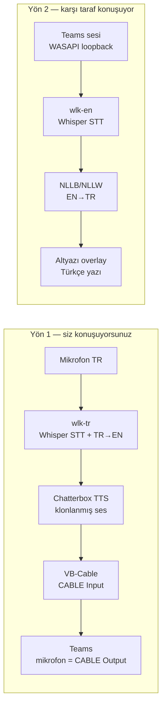

# MS Teams Gerçek Zamanlı Çeviri Sistemi — Araştırma & Mimari Dokümanı

**Tarih:** Eylül 2026
**Donanım:** RTX 5060 Ti 16GB VRAM · 32GB RAM · Python 3.12 · CUDA 12.8 · Ollama kurulu
**Durum:** Araştırma tamamlandı, nihai teknoloji seçimi kullanıcı onayı bekliyor

---

## 1. Özet

İki yönlü, düşük gecikmeli, tamamen yerel (self-hosted) bir çeviri sistemi tasarlanıyor:

- **Yön 1 (siz konuşuyorsunuz):** Mikrofonunuza Türkçe konuşursunuz → sistem bunu anlık olarak İngilizceye çevirir → **sizin Türkçe sesinizin klonundan** üretilen İngilizce sesi VB-Cable üzerinden Teams'e mikrofon girişi olarak yollar.
- **Yön 2 (karşı taraf konuşuyor):** Teams toplantısındaki başka bir katılımcı İngilizce konuşur → sistem bunu yakalar, anlık olarak Türkçeye çevirir → ekranınızda bir altyazı/metin kutusunda gösterir.

Araştırma sonucunda, **her iki yön için de aynı açık kaynak "iskelet" (WhisperLiveKit)** kullanılabildiği, dolayısıyla mimarinin beklenenden çok daha sade kurulabileceği ortaya çıktı. Bu doküman; bileşen araştırmasını, önerilen mimariyi, gecikme/VRAM bütçesini, gerekli paket ve repo listesini ve kurulum yol haritasını içerir. **Nihai karar sizde** — Bölüm 14'te sizden beklenen kararlar listelenmiştir.

---

## 2. Seçilen Mimari — Yüksek Seviye Akış

İki yön de aynı 4 adımlı boru hattını (pipeline) izliyor, sadece son adım farklı (ses vs. yazı):

```
YÖN 1  Mikrofon (TR) → STT+çeviri (Whisper, TR→EN) → TTS klonlama (Chatterbox) → VB-Cable → Teams mikrofonu
YÖN 2  Teams sesi    → STT (Whisper, EN)            → Çeviri (NLLB, EN→TR)      → Ekranda Türkçe altyazı
```


**Kritik araştırma bulgusu:** [WhisperLiveKit](https://github.com/QuentinFuxa/WhisperLiveKit) adlı proje, gerçek zamanlı konuşma tanıma (streaming STT) **ve** eş zamanlı çeviriyi (NLLB tabanlı, 200 dil) tek bir pakette, WebSocket API'si üzerinden sunuyor. Bu, Yön 2'nin STT+çeviri kısmını neredeyse "kutudan çıktığı gibi" çözüyor; Yön 1'in STT+çeviri kısmını da Whisper'ın yerleşik `translate` görevi (herhangi bir dilden doğrudan İngilizceye) ile tek adımda çözüyor.



---

## 3. Bileşen Araştırması

### 3.1 Ses yakalama & yönlendirme (Windows)

| İhtiyaç | Araç | Not |
|---|---|---|
| Mikrofon girişi yakalama | `sounddevice` / `PyAudioWPatch` | Standart WASAPI mikrofon akışı |
| Sentezlenmiş İngilizce sesi Teams'e mikrofon olarak vermek | **VB-Audio VB-CABLE** | Ücretsiz/bağışlı sanal ses kartı. Uygulama sesi "CABLE Input"e yazar, Teams'in mikrofonu "CABLE Output" olarak ayarlanır. |
| Teams'teki karşı tarafın sesini (hoparlör çıkışını) yakalamak | **[PyAudioWPatch](https://github.com/s0d3s/PyAudioWPatch)** (WASAPI loopback) | **İkinci bir VB-Cable'a gerek yok** — Windows'un WASAPI loopback modu, herhangi bir çıkış cihazının (hoparlör/kulaklık) sesini doğrudan Python'a kayıt olarak verir. `pip install PyAudioWPatch`, MIT lisanslı. |
| (Opsiyonel) yalnızca Teams uygulamasının sesini izole yakalamak | WASAPI **Process Loopback** (Windows 10 2004+) | Diğer programların sesini (bildirim, müzik) karıştırmadan sadece Teams'i dinlemek isterseniz. Referans: [egeorcun/commonmik](https://github.com/egeorcun/commonmik) (per-app WASAPI loopback mikser, Türkçe arayüzlü). |
| (Alternatif) Teams Web (tarayıcıda) kullanılıyorsa | WhisperLiveKit'in dahili **Chrome eklentisi** | Teams'i Chrome'da web uygulaması olarak açarsanız, WLK'nin `chrome-extension` klasörü sekme sesini doğrudan yakalayıp altyazı üretebilir — WASAPI loopback'e bile gerek kalmaz. Teams masaüstü istemcisi kullanıyorsanız bu seçenek uygulanmaz. |

> Docker'da ses cihazı erişimi sorunu: Docker Desktop (WSL2 arka uç) konteynerlerin Windows'un ses aygıtlarına (mikrofon, hoparlör, VB-Cable) doğrudan erişmesine izin vermez. Bu yüzden **ses yakalama/oynatma kodu Windows üzerinde native Python 3.12 ile çalışmalı**; GPU'da çalışan ağır modeller (STT/çeviri/TTS sunucuları) Docker'da olabilir, aralarındaki iletişim `localhost` WebSocket/HTTP üzerinden yapılır.

### 3.2 Konuşma tanıma (STT)

**Seçilen:** [WhisperLiveKit](https://github.com/QuentinFuxa/WhisperLiveKit) (`wlk`) — 10.5k yıldız, Apache-2.0, `pip install whisperlivekit`.

- SimulStreaming/AlignAtt politikası (2025 SOTA) ile Whisper'ı **gerçek gerçek-zamanlı** hale getiriyor (ham Whisper 30 saniyelik bloklar bekler, bu proje kelime/ifade bazlı kısmi sonuç üretir).
- Backend olarak `faster-whisper` (CTranslate2, GPU) kullanıyor — sizin CUDA 12.8 kurulumunuzla uyumlu.
- WebSocket (`ws://localhost:PORT/asr`) ve OpenAI/Deepgram uyumlu REST API sunuyor.
- Konuşmacı ayrımı (diarization), VAD (Silero), çoklu backend (faster-whisper, MLX, Voxtral, Qwen3-ASR) destekliyor — ihtiyacınız olmasa da hazır.
- Docker imajı hazır (`docker build -t wlk .` + `--gpus all`), `compose.yml` içinde GPU profilleri tanımlı.

**Türkçe doğruluğu için opsiyonel iyileştirme:** `openai/whisper-large-v3` Türkçe'de zaten iyi performans gösterir, ancak Türkçe'ye özel fine-tune edilmiş, faster-whisper ile doğrudan uyumlu bir CTranslate2 modeli mevcut:
[`oguzhangokboru/whisper-large-v3-tr`](https://huggingface.co/oguzhangokboru/whisper-large-v3-tr) (WER ~%8.8, CTranslate2 float16). `wlk --model-path oguzhangokboru/whisper-large-v3-tr` ile takılabilir.

⚠️ **Önemli nüans:** Whisper'ı sadece transkripsiyon için ince ayar yapmak, genellikle modelin yerleşik "→İngilizceye çevir" yeteneğini bozar/zayıflatır. Yani bu Türkçe fine-tune modeli **transkripsiyon kalitesini** artırır ama muhtemelen `--direct-english-translation` bayrağıyla birlikte orijinal `large-v3` kadar iyi çeviri yapamaz. Bölüm 4'te bunun için iki seçenek sunuyorum.

### 3.3 Makine çevirisi (MT)

WhisperLiveKit iki farklı çeviri yolu sunuyor:

1. **Whisper'ın yerleşik `translate` görevi** (`--direct-english-translation`): Herhangi bir dilden **doğrudan İngilizceye**, ekstra model yüklemeden, tek geçişte. Yön 1 (TR→EN) için ideal — ekstra gecikme eklemez.
2. **NLLW** ([QuentinFuxa/NoLanguageLeftWaiting](https://github.com/QuentinFuxa/NoLanguageLeftWaiting)) — distile edilmiş **NLLB-200** üzerine kurulu, akan (streaming) kısmi metni doğru şekilde çevirmek için özel olarak tasarlanmış bir "eş zamanlı çeviri" motoru (`--target-language tur_Latn`). 200 dil arasında çeviri yapabiliyor. Yön 2 (EN→TR) için gerekli — Whisper kendi başına İngilizce dışına çeviri yapamaz.

⚠️ **Lisans notu:** NLLB-200 modelleri **CC-BY-NC-4.0** (ticari olmayan kullanım) lisansı altındadır. Kişisel/dahili kullanım için (kendi toplantılarınızda kullanmak) sorun teşkil etmez, ancak bunu ticari bir ürün/servis haline getirmeyi düşünürseniz bu modelin yerine Apache-2.0/CC-BY-4.0 lisanslı **Helsinki-NLP OPUS-MT** (`opus-mt-tr-en`, `opus-mt-tc-big-en-tr`) veya **MADLAD-400** modellerine geçmeniz gerekir (çeviri kalitesi NLLB kadar iyi olmayabilir, test edilmeli).

**Ollama'nın rolü (opsiyonel, faz 2):** Gerçek zamanlı akışın içine bir LLM sokmak gecikmeyi artıracağından önerilmez. Ancak, ekranda **kesinleşmiş** (artık değişmeyecek) cümleler üzerinde arka planda, **canlı akışı bloklamadan**, küçük bir Ollama modeliyle (örn. `qwen2.5:3b`, `gemma2:2b`) ikinci bir "cilalama" geçişi yapıp metni daha akıcı hale getirmek mümkün — bu tamamen opsiyonel bir faz 2 iyileştirmesi olarak düşünülebilir.

### 3.4 Metinden sese + ses klonlama (TTS)

Bu, projenin en kritik kararı çünkü hem Türkçe referans sesten klonlama hem İngilizce çıktı hem de düşük gecikme gerekiyor. Karşılaştırılan modeller:

| Model | Lisans | TR destekli mi? | Çapraz dil klonlama | İlk paket gecikmesi | Not |
|---|---|---|---|---|---|
| **Chatterbox (Resemble AI)** ✅ önerilen | **MIT** | ✅ Evet (23 dilden biri) | ✅ Evet, 10sn referans yeterli | ~150-200ms (Turbo: 350M param) | Aktif geliştiriliyor, RTX 50 serisi (Blackwell/CUDA 12.8) resmi destekli |
| CosyVoice2 (Alibaba/FunAudioLLM) | Apache-2.0 | ⚠️ Belirsiz (9 dil resmi listede, TR yok ama çapraz-dil klonlama farklı dillerde de denenebiliyor) | ✅ Evet | ~150ms | Çok güçlü ama TR referans kalitesi test edilmeli |
| XTTS-v2 (Coqui) | **CPML (ticari değil)** | ✅ Evet (17 dil) | ✅ Evet, 6sn referans | <150ms iddiası | Şirket kapandı, topluluk sürdürüyor, lisans kısıtlı |
| Fish Speech / OpenAudio S1 | Apache-2.0 benzeri | Kısmen | ✅ | Düşük | Çok dilli güçlü ama TR referans testi gerekir |
| GPT-SoVITS | MIT | Kısmen | ✅ | Değişken | Daha çok tek-dil/az-örnekli fine-tune odaklı, sıfır-atış klonlama diğerleri kadar olgun değil |
| OpenVoice V2 | MIT | Kısmen | ✅ (ton-rengi aktarımı) | Orta | İki aşamalı mimari (temel TTS + ton rengi dönüştürücü) |
| Kyutai Hibiki (S2ST) | Araştırma amaçlı | ❌ Şu an sadece FR→EN | Sesi otomatik koruyor | Çok düşük (~ gerçek zamanlı) | Doğrudan konuşmadan-konuşmaya çeviri mimarisi olarak ilham verici, ama dil kapsamı (TR yok) proje için kullanılamaz kılıyor |

**Neden Chatterbox öne çıktı:** Resmi dil listesinde **Turkish (tr)** açıkça var (hem referans/klonlama dili hem çıktı dili olarak), **MIT lisanslı** (hiçbir ticari/kişisel kullanım kısıtı yok), ve doğrudan sizin GPU'nuz için resmi destek var:

> devnen/Chatterbox-TTS-Server README'sinden: *"RTX 5060 Ti, 5070, 5070 Ti, 5080, 5090 (Blackwell) GPU'lar için `docker-compose-cu128.yml` kullanın"* — bu tam olarak sizin kartınız.

**Sunucu sarmalayıcı:** [devnen/Chatterbox-TTS-Server](https://github.com/devnen/Chatterbox-TTS-Server) (1.4k yıldız, MIT) tam ihtiyacınız olan şeyi sunuyor:
- `./voices` klasöründe **çoklu "hazır ses" (predefined voice)** dosyaları → "çoklu ses dosyalarında ses tarzı seçimi" isteğinizi doğrudan karşılıyor.
- `./reference_audio` klasöründe **ses klonlama** referans dosyaları (kendi Türkçe sesiniz burada olacak).
- `config.yaml` içinde `default_voice_id` alanı → varsayılan olarak klonlanmış sesinizi seçebilirsiniz.
- OpenAI uyumlu `/v1/audio/speech` + özel `/tts` (chunk-seviyeli streaming, `stream: true`) API.
- Web arayüzü (ses yükleme, parametre ayarlama, A/B test için 3 farklı Chatterbox motoru arasında anlık geçiş: Original / Multilingual / Turbo).

⚠️ **Test edilmesi gereken nokta:** `Chatterbox-Turbo` (350M, en düşük gecikme) resmi olarak "düşük gecikmeli **İngilizce** ses ajanları" için konumlandırılmış; 23 dilli çapraz-dil klonlama özelliği asıl **Multilingual** (0.5B) modelinde belgeleniyor. Yani muhtemelen: önce **Multilingual** motoruyla başlayıp Türkçe referans sesinizin İngilizce çıktıda ne kadar iyi korunduğunu test etmeli, gecikme fazla geliyorsa Turbo'yu da deneyip kalite/hız dengesine bakmalısınız. Sunucu bu ikisi arasında yeniden başlatma gerektirmeden geçiş yapabiliyor.

⚠️ **Python sürüm çakışması:** Chatterbox-TTS-Server **Python 3.10 zorunlu kılıyor** (torch/ONNX önceden derlenmiş wheel'leri sadece 3.10'da var); sizde **Python 3.12** kurulu. Bu çakışmayı Docker ile tamamen ortadan kaldırıyoruz (bkz. Bölüm 3.6).

### 3.5 Ekran üzeri altyazı / overlay arayüzü (Yön 2 çıktısı)

"Ekranda bir inputa basma" isteğinizi iki şekilde yorumlayıp öneriyorum:

| Seçenek | Açıklama | Efor |
|---|---|---|
| **A — En hızlı başlangıç** | WhisperLiveKit'in kendi web arayüzünü (`http://localhost:8002`) küçük bir tarayıcı penceresinde Teams'in yanına sabitleyin. Sıfır ek kod. | 0 |
| **B — Önerilen (cilalı)** | Küçük, her zaman üstte (always-on-top), çerçevesiz bir Python penceresi (`pywebview` veya `tkinter`), `wlk-en`'in `/asr` WebSocket'ine bağlanıp sadece son kesinleşen Türkçe cümleyi büyük punto altyazı gibi gösterir — YouTube canlı yayın altyazısı hissi. | ~100-150 satır kod |
| **C — Gerçek "input"a basma** | Odaklanılan herhangi bir metin kutusuna (örn. Teams sohbet kutusu) `pyautogui`/`keyboard` ile karakter göndermek. | Kırılgan: pencere odağına bağımlı, yanlışlıkla mesaj gönderme riski var. **Önerilmez**, sadece siz özellikle Teams sohbetine yazı düşmesini istiyorsanız değerlendirin. |

Varsayılan öneri: **B**. Referans/ilham için: [KazKozDev/live-translation](https://github.com/KazKozDev/live-translation) benzer bir "glass overlay" fikrini macOS'ta uyguluyor (Whisper + Ollama + BlackHole) — mimari fikir olarak faydalı ama doğrudan kullanılamaz (macOS'a özel, VB-Cable yerine BlackHole kullanıyor, sizin Windows/VB-Cable/Chatterbox yığınınıza uymuyor).

### 3.6 Orkestrasyon: Docker mu, native mi?

**Öneri: Hibrit.**

- **Docker Compose içinde (GPU'lu):** `wlk-tr`, `wlk-en`, `chatterbox-tts` — üçü de sadece ağ üzerinden (WebSocket/HTTP) konuşuyor, ses donanımına ihtiyaçları yok. Docker Desktop + WSL2, NVIDIA CUDA GPU passthrough'u yıllardır olgun şekilde destekliyor; 16GB VRAM'iniz üç modeli aynı anda rahatça barındırır (bkz. Bölüm 6). Chatterbox'ın Python 3.10 gereksinimini de bu şekilde bertaraf etmiş oluyoruz — konteyner kendi izole ortamını taşır, sisteminizdeki 3.12'yi hiç etkilemez.
- **Native Windows Python 3.12 (Docker dışında):** Mikrofon yakalama, WASAPI loopback yakalama, VB-Cable'a ses oynatma, overlay penceresi — bunlar ses donanımına doğrudan eriştiği için Windows üzerinde native çalışmalı.

Bu ayrım hem "kolayca ayağa kalkmalı" hem "minimum gecikme" hedeflerinizi birlikte karşılıyor: ağır modeller izole/tekrarlanabilir Docker imajlarında, gecikmeye duyarlı ses G/Ç'si doğrudan donanıma yakın native kodda.

---

## 4. Yön 1 — Detaylı Veri Akışı (TR mikrofon → EN klonlanmış ses)

1. `mic_client.py` (native, Python 3.12) mikrofonu `sounddevice` ile 16kHz mono PCM olarak sürekli okur, ham baytları `wlk-tr`'nin `/asr` WebSocket'ine akıtır. VAD/parçalama işini WLK sunucu tarafında kendisi yapar (Silero VAD + VAC) — istemcinin ekstra bir şey yapmasına gerek yok.
2. `wlk-tr` konteyneri (**Seçenek A:** `wlk --model large-v3 --language tr --direct-english-translation`) konuşmayı Whisper'ın yerleşik çeviri göreviyle **doğrudan İngilizce metne** çevirir; kısmi ("buffer", gri) ve kesinleşmiş ("validated") parçaları WebSocket üzerinden anlık geri yollar.
   - **Seçenek B** (daha isteğe bağlı, daha yüksek Türkçe transkripsiyon doğruluğu ama bir adım daha yavaş): `wlk --model-path oguzhangokboru/whisper-large-v3-tr --language tr --target-language eng_Latn` → Türkçe'ye özel model + ayrı NLLW çeviri adımı.
3. `mic_client.py`, kesinleşmiş (validated) İngilizce cümle/ifade parçalarını biriktirip **cümle sınırında** (nokta, virgül, ya da WLK'nin verdiği zaman damgası boşluğunda) Chatterbox TTS sunucusunun `/tts` uç noktasına `stream: true` ile POST eder; `voice_mode=clone`, `reference_audio_filename=<sizin_klonunuz>.wav`.
4. Chatterbox chunk-seviyeli WAV baytlarını akıtarak döner; `mic_client.py` bu baytları aldıkça `sounddevice` ile **VB-Cable "CABLE Input"** çıkışına oynatır.
5. MS Teams'te mikrofon cihazı olarak **"CABLE Output (VB-Audio Virtual Cable)"** seçili olduğu için, karşı taraf sizin klonlanmış İngilizce sesinizi duyar.

**Neden 10 saniye beklemiyor:** Adım 2 ve 3, tüm cümle bitene kadar değil, WLK'nin kesinleştirdiği her alt-ifade parçası geldikçe tetiklenir; TTS de chunk-seviyeli stream olduğu için ilk ses baytları metnin tamamı sentezlenmeden oynatılmaya başlar. Sonuç: siz konuşurken karşı taraf birkaç yüz milisaniye-birkaç saniye arayla "parça parça" duymaya başlar, tek seferde 10 saniye beklemez.

## 5. Yön 2 — Detaylı Veri Akışı (Teams EN sesi → TR altyazı)

1. `loopback_client.py` (native), `PyAudioWPatch` ile varsayılan çıkış cihazınızın (kulaklık/hoparlör) WASAPI loopback akışını okur, `wlk-en`'in `/asr` WebSocket'ine akıtır.
2. `wlk-en` konteyneri: `wlk --model large-v3 --language en --target-language tur_Latn` — İngilizce konuşmayı tanır, **NLLW motoruyla** anlık Türkçeye çevirir; kısmi + kesinleşmiş metni WebSocket'ten geri yollar.
3. Overlay penceresi (Bölüm 3.5, Seçenek B) bu akışı doğrudan dinler, ekranda günceller.

---

## 6. Donanım Bütçesi ve Beklenen Gecikme (tahmini)

### VRAM (16GB kartınız için)

| Bileşen | Model | Yaklaşık VRAM |
|---|---|---|
| `wlk-tr` (Yön 1 STT+çeviri) | Whisper large-v3, faster-whisper int8/fp16 | ~2-3 GB |
| `wlk-en` (Yön 2 STT) | Whisper large-v3 (veya `medium` ile daha hafif) | ~1.5-3 GB |
| NLLW/NLLB (Yön 2 çeviri, `wlk-en` içinde) | 600M distilled, ctranslate2 int8 | ~1-1.5 GB |
| Chatterbox TTS | Multilingual 0.5B veya Turbo 350M | ~1.5-3 GB |
| **Toplam (kaba tahmin)** | | **~7-11 GB** |

16GB'lık kartınızda rahat bir marj kalıyor; üç servisi aynı anda GPU'da tutabilirsiniz.

### Uçtan uca gecikme (yayınlanmış bileşen ölçümlerinden tahmini — kendi donanımınızda `wlk bench` ile doğrulanmalı)

| Adım | Tahmini süre |
|---|---|
| VAD/parça tetikleme | 200-500ms (ayarlanabilir sessizlik eşiği) |
| Whisper streaming kısmi sonuç | ~200-500ms |
| NLLB/NLLW çeviri adımı (sadece Yön 2, ve Yön 1 Seçenek B) | ~100-300ms |
| Chatterbox TTS ilk ses paketi | ~150-300ms (Turbo modeliyle) |
| Ağ/IPC (localhost WebSocket/HTTP) | ~10-50ms/adım |
| **Yön 1 toplam (cümle sonu → ilk EN ses)** | **~0.8-2 sn** (tahmini) |
| **Yön 2 toplam (konuşma → TR altyazı)** | **~0.5-1.5 sn** (tahmini) |

Bunlar kelime-kelime simültane çeviri (profesyonel konferans tercümanı gibi <1sn kayma) değil, **ifade/cümle parçası bazlı düşük gecikmeli** çeviridir — 10 saniyelik bloklar yerine.

---

## 7. Lisans Notları (özet)

| Bileşen | Lisans | Ticari kullanım |
|---|---|---|
| WhisperLiveKit | Apache-2.0 | ✅ Serbest |
| Whisper (openai) / faster-whisper | MIT | ✅ Serbest |
| NLLB-200 / NLLW | **CC-BY-NC-4.0** | ❌ Ticari değil — kişisel/dahili kullanım OK |
| Chatterbox (model) | MIT | ✅ Serbest |
| devnen/Chatterbox-TTS-Server | MIT | ✅ Serbest |
| PyAudioWPatch | MIT | ✅ Serbest |
| VB-CABLE | Ücretsiz (bağış istekli), kapalı kaynak | Kişisel kullanım serbest |

Projeniz kişisel/dahili bir üretkenlik aracı olduğu için hiçbiri sorun teşkil etmiyor. İleride bunu satılan bir ürüne dönüştürürseniz NLLB'yi Apache-2.0 lisanslı bir alternatifle (OPUS-MT, MADLAD-400) değiştirmeniz gerekir.

---

## 8. Önerilen Teknoloji Yığını (özet tablo)

| Katman | Seçim | Alternatif |
|---|---|---|
| STT (her iki yön) | WhisperLiveKit + faster-whisper (large-v3) | whisper.cpp, WhisperLive (Collabora) |
| MT (Yön 1) | Whisper `--direct-english-translation` | NLLW ile ayrı adım (Seçenek B) |
| MT (Yön 2) | NLLW (NLLB-200 distilled 600M) | Helsinki-NLP OPUS-MT (ticari-güvenli alternatif) |
| TTS + klonlama | Chatterbox Multilingual/Turbo + devnen sunucusu | CosyVoice2, Fish Speech, XTTS-v2 (lisans kısıtlı) |
| Ses yönlendirme | VB-CABLE + PyAudioWPatch | Voicemeeter, CommonMik |
| Overlay UI | Özel `pywebview`/`tkinter` penceresi | WLK'nin hazır web arayüzü |
| Orkestrasyon | Docker Compose (modeller) + native Python 3.12 (ses G/Ç) | Tamamen native (Docker'sız) |
| Kayıt/log (opsiyonel) | SQLite (`transcript.db`) | — |
| Faz 2 (opsiyonel) | Ollama ile arka planda çeviri cilalama | — |

---

## 9. Python Paketleri (native orkestratör için taslak `requirements.txt`)

```txt
# Ses yakalama / oynatma (Windows, WASAPI)
PyAudioWPatch>=0.2.12.6
sounddevice>=0.4.6
numpy>=1.26

# WLK / Chatterbox sunucularıyla haberleşme
websockets>=12.0
httpx>=0.27

# Overlay arayüzü
pywebview>=5.0        # ya da: tkinter (Python ile birlikte gelir, ek kurulum gerekmez)

# Konfig / yardımcı
python-dotenv>=1.0
pydantic>=2.7

# Opsiyonel: transkript kaydı
# sqlite3 → Python standart kütüphanesinde, kurulum gerekmez
```

> Not: `whisperlivekit` ve `chatterbox-tts` paketleri **Docker imajları içinde** kurulacağı için bu native `requirements.txt`'e dahil edilmedi. Eğer Docker'sız, tamamen native kurulum tercih ederseniz, WLK'yi aynı Python 3.12 ortamına (`pip install "whisperlivekit[cu129,translation]"`), Chatterbox sunucusunu ise **ayrı bir Python 3.10 sanal ortamına** kurmanız gerekir.

---

## 10. Docker Compose İskeleti (taslak)

```yaml
services:
  wlk-tr:
    image: wlk-tr-image          # QuentinFuxa/WhisperLiveKit reposundan build edilir
    build:
      context: ./WhisperLiveKit
      dockerfile: Dockerfile
    command: >
      wlk --model large-v3 --language tr --direct-english-translation
          --host 0.0.0.0 --port 8001
    ports: ["8001:8001"]
    deploy:
      resources:
        reservations:
          devices: [{ driver: nvidia, count: 1, capabilities: [gpu] }]

  wlk-en:
    image: wlk-en-image
    build:
      context: ./WhisperLiveKit
      dockerfile: Dockerfile
    command: >
      wlk --model large-v3 --language en --target-language tur_Latn
          --host 0.0.0.0 --port 8002
    ports: ["8002:8002"]
    deploy:
      resources:
        reservations:
          devices: [{ driver: nvidia, count: 1, capabilities: [gpu] }]

  chatterbox-tts:
    build:
      context: ./Chatterbox-TTS-Server
      dockerfile: Dockerfile.cu128       # RTX 5060 Ti / Blackwell (sm_120) için
    ports: ["8004:8004"]
    volumes:
      - ./voices:/app/voices                       # hazır/çoklu sesler
      - ./reference_audio:/app/reference_audio      # sizin TR klonunuz burada
      - ./config.yaml:/app/config.yaml
    deploy:
      resources:
        reservations:
          devices: [{ driver: nvidia, count: 1, capabilities: [gpu] }]
```

`docker compose up -d --build` ile üçü de ayağa kalkar; native `mic_client.py` ve `loopback_client.py` bu üç servise `localhost:8001/8002/8004` üzerinden bağlanır.

---

## 11. GitHub Repo & HF Model Listesi

**Çekirdek (doğrudan kullanılacak):**
- STT+MT iskeleti: https://github.com/QuentinFuxa/WhisperLiveKit
- Eş zamanlı çeviri motoru: https://github.com/QuentinFuxa/NoLanguageLeftWaiting
- TTS model: https://github.com/resemble-ai/chatterbox
- TTS sunucusu: https://github.com/devnen/Chatterbox-TTS-Server
- WASAPI loopback: https://github.com/s0d3s/PyAudioWPatch
- VB-CABLE: https://vb-audio.com/Cable/

**HF modelleri:**
- Türkçe fine-tune Whisper (opsiyonel): https://huggingface.co/oguzhangokboru/whisper-large-v3-tr
- Chatterbox Multilingual: https://huggingface.co/ResembleAI/chatterbox
- NLLB-200 distilled 600M: https://huggingface.co/facebook/nllb-200-distilled-600M

**İlham/referans (doğrudan bağımlılık değil):**
- Benzer konsept (macOS, tek yön, Ollama tabanlı): https://github.com/KazKozDev/live-translation
- Per-app WASAPI loopback mikser (Türkçe arayüzlü): https://github.com/egeorcun/commonmik
- Mikrofon+sistem sesi karıştırma örneği: https://github.com/Aws-Nassar/LineCast

**Değerlendirilip elenen/ikincil TTS alternatifleri:**
- CosyVoice2: https://github.com/FunAudioLLM/CosyVoice
- Fish Speech: (fishaudio organizasyonu, HuggingFace üzerinde "Fish Speech V1.5")
- XTTS-v2 (lisans kısıtlı): https://huggingface.co/coqui/XTTS-v2
- OpenVoice V2: https://github.com/myshell-ai/OpenVoice
- Kyutai Hibiki (S2ST ilham kaynağı, TR desteklemiyor): https://github.com/kyutai-labs/hibiki

---

## 12. Kurulum Yol Haritası (yüksek seviye)

1. **VB-CABLE'ı kurun**, Windows'u yeniden başlatın.
2. **Docker Desktop**'ı NVIDIA GPU desteğiyle (WSL2 arka uç) kurun, `nvidia-smi`'nin konteyner içinden görünür olduğunu doğrulayın.
3. `WhisperLiveKit` ve `Chatterbox-TTS-Server` repolarını klonlayın, yukarıdaki `docker-compose.yml` ile üç servisi ayağa kaldırın.
4. Kendi sesinizden **15-30 saniyelik temiz bir Türkçe referans kaydı** alın (sessiz ortam, tek mikrofon), `./reference_audio/` klasörüne koyun; `config.yaml`'da `default_voice_id` olarak işaretleyin.
5. `wlk bench` ile kendi donanımınızda gerçek gecikme rakamlarını ölçün, model boyutunu (large-v3 / medium / turbo) buna göre ayarlayın.
6. Native `mic_client.py` ve `loopback_client.py` betiklerini yazın (Bölüm 4-5'teki akışı uygular).
7. Basit overlay penceresini ekleyin.
8. MS Teams'te mikrofon = **CABLE Output**, hoparlör = kendi kulaklığınız olarak ayarlayın; toplantıda test edin.

---

## 13. Kesin Kararlar

Araştırma tamamlandı; aşağıdaki noktalarda son kararı siz vereceksiniz:

1. **Orkestrasyon:** tamamen native iki ayrı Python sanal ortamı
2. **Yön 1 çeviri stratejisi:** Whisper'ın yerleşik `--direct-english-translation`'ı (daha hızlı, tek model) mi, yoksa Türkçe fine-tune STT + ayrı NLLW çeviri adımı (muhtemelen daha doğru transkripsiyon, biraz daha yavaş) mı?
3. **TTS motoru:** Chatterbox **Multilingual** (0.5B, dil kapsamı belgeli) ve **Turbo** (350M, daha hızlı ama çapraz-dil klonlama garantisi daha az belgeli) ikisinide deneyip karar vereceğiz
4. **Overlay arayüzü:** Hazır WLK web sayfası kullanalım.
5. **Whisper model boyutu:** `large-v3` için `medium`/`turbo` (daha hızlı, hafif doğruluk kaybı) model kullanalım — özellikle Yön 2 (İngilizce, genelde Whisper için daha kolay bir dil) için daha küçük model denenebilir.
6. **Transkript kaydı:** Local SQLite'a toplantı metni log'u tutulsun


---

## 14. Bilinen Riskler / Sınırlamalar

- **Gerçek gecikme rakamları donanıma özeldir** — yukarıdaki tahminler yayınlanmış model ölçümlerinden derlendi, sizin RTX 5060 Ti'nizde `wlk bench` ile doğrulanmalı.
- **Chatterbox'ın Türkçe→İngilizce çapraz-dil klonlama kalitesi** resmi olarak test edilmiş/belgelenmiş değil (dil listesinde Türkçe var ama örnekler çoğunlukla İngilizce/Çince/İspanyolca ağırlıklı) — kendi sesinizle deneme yapmadan garanti verilemez.
- **NLLB'nin lisansı** (CC-BY-NC) ticari kullanım için uygun değil; bu proje kişisel kaldığı sürece sorun yok.
- **MS Teams sanal mikrofon/hoparlör tespiti** bazı kurumsal Teams politikalarında (ör. "sadece onaylı cihazlar") engellenmiş olabilir — kurumsal bir hesapla kullanıyorsanız BT politikalarını kontrol edin.
- **Gizlilik:** Toplantı sesi hem sizin makinenizde hem de (varsayılan ayarlarla) sadece yerel Docker konteynerlerinde işleniyor — hiçbir ses/metin dışarıya gönderilmiyor (tamamen self-hosted). Transkript loglaması açarsanız (Bölüm 13, madde 6), KVKK/şirket politikaları açısından katılımcıları bilgilendirmeniz gerekebilir.

---

## 15. Kaynaklar

Tüm bağlantılar Bölüm 11'de toplanmıştır. Ayrıca faydalı olabilecek genel kaynaklar:
- WhisperLiveKit dokümantasyonu: https://github.com/QuentinFuxa/WhisperLiveKit/blob/main/docs/API.md
- Chatterbox TTS Server API dokümantasyonu: https://github.com/devnen/Chatterbox-TTS-Server/blob/main/documentation.md
- NVIDIA Container Toolkit kurulum kılavuzu: https://docs.nvidia.com/datacenter/cloud-native/container-toolkit/install-guide.html
